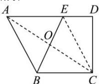
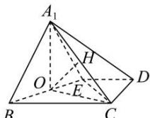

> [!faq]- 全练一本通解析
> **【答案】** $\frac{\sqrt{6}}{2}$
>
> **【解析】**
> 作 $BE$ 的中点 $O$ , 连接 $A_{1}O, CO, CE$ ,
> 
> 
> 因为 BC=2, AD=3, DE=1, 所以 AE=BC=2,
> 又因为 $AD \parallel BC$ , 所以 $AE \parallel BC$ ,
> 所以四边形 ABCE 是平行四边形，
> 因为 $CD = \sqrt{3}$ ， $DE = 1$ ， $AD\perp CD$ ，
> 所以 $CE = \sqrt{DE^2 + CD^2} = 2 = BC$ ，且 $\angle DEC = 60^{\circ}$ 所以平行四边形ABCE为边长为2的菱形，且 $\angle BAE = \angle BCE = \angle DEC = 60^{\circ}$ 所以△ABE和△BEC都是正三角形，
> 所以 $A_{1}O\bot BE$ ， $CO\bot BE$ 又因为 $A_{1}O\cap CO = O$ ， $A_{1}O$ 、 $CO\subset$ 平面 $A_{1}OC$ 所以 $BE\bot$ 平面 $A_{1}OC$ 过 $O$ 作 $OH\bot A_{1}C$ 于点 $H$ 因为 $OH\subset$ 平面 $A_{1}OC$ ，所以 $BE\bot OH$ 则 $OH$ 为异面直线 $A_{1}C$ 与 $BE$ 的公垂线段，
> 因为平面 $A_{1}BE\bot$ 平面BCDE，
> 平面 $A_{1}BE\cap$ 平面 $BCDE = BE$ ， $A_{1}O\bot BE$ ， $A_{1}O\subset$ 平面 $A_{1}BE$ 所以 $A_{1}O\bot$ 平面BCDE， $OC\subset$ 平面BCDE，则 $A_{1}O\bot CO$ 又因为 $A_{1}O = OC = \sqrt{3}$ ，所以△ $A_{1}OC$ 为等腰直角三角形，
> 所以 $OH = \sqrt{3}\cdot \sin 45^{\circ} = \frac{\sqrt{6}}{2}$ ，即异面直线 $A_{1}C$ 与 $BE$ 的距离为 $\frac{\sqrt{6}}{2}$ 故答案为： $\frac{\sqrt{6}}{2}$
