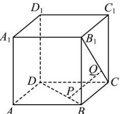

<!-- question-source:start -->
【50】（22-23高一下·山东青岛·期末）如图，正方体 $ABCD-A_{1}B_{1}C_{1}D_{1}$ 的棱长为1，设直线l与BD, $B_{1}C$ 分别交于点P,Q，且 $l\perp BD,l\perp B_{1}C$ ，则线段PQ的长为（）

A. $\frac{\sqrt{2}}{3}$ B. $\frac{\sqrt{3}}{3}$ C. $\frac{\sqrt{6}}{3}$ D. $\frac{\sqrt{6}}{6}$
<!-- question-source:end -->

![[Q00006064A1]]
