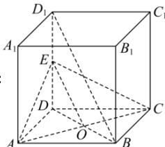

> [!faq]- 全练一本通解析
> **【答案】** $\frac{\sqrt{6}}{3}$
>
> **【解析】**
> 
> 如图, 取 $DD_{1}$ 的中点 E, 连接 BD 交 AC 于点 O, 连接 OE,
> 则 OE 是 $BD_{1}$ 的中位线, 有 $OE \perp AC$ , $OE // BD_{1}$ 且 $OE = \frac{1}{2} BD_{1}$ ,
> 所以异面直线 $BD_{1}$ 与 AC 的距离为 $BD_{1}$ 到平面 EAC 的距离,
> 即点 D 到平面 EAC 的距离, 设该距离为 h,
> 由题意得, $AC = 2\sqrt{2}$ , DE = 1, $OE = \sqrt{3}$ ,
> 由 $V_{D-EAC}=V_{E-ADC}$ ，得 $\frac{1}{3}\times\frac{1}{2}\times\sqrt{3}\times2\sqrt{2}h=\frac{1}{3}\times\frac{1}{2}\times2\times2\times1$ 解得 $h=\frac{\sqrt{6}}{3}$ . 故答案为: $\frac{\sqrt{6}}{3}$
