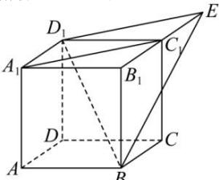

> [!faq]- 全练一本通解析
> **【答案】** $\frac{\sqrt{6}}{6}$ 解析·加图所示
>
> **【解析】**
> 如图所示,
> 
> $$
> D _ {1} E / / A _ {1} C _ {1}, D _ {1} E = A _ {1} C _ {1}
> $$
> $$
> A _ {1} C _ {1} / / D _ {1} E
> $$
> $$
> A _ {1} C _ {1} E D
> $$
> $$
> D _ {1} E \subset
> $$
> $$
> A _ {1} C _ {1} / /
> $$
> $$
> B D _ {1} E
> $$
> $$
> B D _ {1} E
> $$
> 则 $A_{1}C_{1}$ 与 $BD_{1}$ 间的距离就等于 $A_{1}C_{1}$ 与平面 $BD_{1}E$ 间的距离，就等于点 $A_{1}$ 到平面 $BD_{1}E$ 的距离 d，
> 考虑四面体 $A_{1}-BED_{1}$ ，则 $V_{四面体B-A_{1}D_{1}E}=\frac{1}{3}\cdot S_{\triangle A_{1}D_{1}E}\cdot BB_{1}=\frac{1}{3}\times\frac{1}{2}\times\sqrt{2}\times\sin135^{\circ}\times1=\frac{1}{6}$ 而 $V_{四面体A_{1}-BD_{1}E}=\frac{1}{3}\cdot S_{\triangle BD_{1}E}\cdot d=\frac{1}{3}\times\frac{1}{2}\times\sqrt{3}\times\sqrt{2}\times d=\frac{\sqrt{6}}{6}d$ ∴ $\frac{\sqrt{6}}{6}d = \frac{1}{6}$ ，因此 $d = \frac{\sqrt{6}}{6}$ .
> ∴ $A_{1}C_{1}$ 与 $BD_{1}$ 间的距离为 $\frac{\sqrt{6}}{6}$ .
