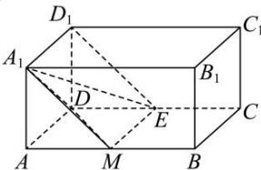

> [!faq]- 全练一本通解析
> **【答案】** C
>
> **【解析】**
> 解析：
> 
> 取 $AB$ 中点 $M$ ，连接 $A_{1}M,DM,EM,A_{1}E$ ，由 $AD / / A_1D_1$ ， $AD = A_1D_1$ ， $AD / / ME$ ， $AD = ME$ ，则 $A_{1}D_{1} / / ME,A_{1}D_{1} = ME$ ， $\therefore$ 四边形 $A_{1}D_{1}EM$ 为平行四边形，则 $D_{1}E / / A_{1}M$ 又 $D_{1}E\not\subset$ 平面 $A_{1}DM$ ， $A_{1}M\subset$ 平面 $A_{1}DM$ ，则 $D_{1}E / /$ 平面 $A_{1}DM$ 故异面直线 $A_{1}D$ 与 $D_{1}E$ 之间的距离 $\Leftrightarrow D_{1}E$ 与平面 $A_{1}DM$ 之间的距离 $\Leftrightarrow$ 点 $E$ 与平面 $A_{1}DM$ 之间的距离，设点 $E$ 与平面 $A_{1}DM$ 之间的距离为 $d$ ，由题意可得， $A_{1}D = A_{1}M = DM = \sqrt{2}$ 则 $S_{\triangle A_1DM} = \frac{1}{2} A_1D\cdot A_1M\sin \frac{\pi}{3} = \frac{1}{2}\times \sqrt{2}\times \sqrt{2}\times \frac{\sqrt{3}}{2} = \frac{\sqrt{3}}{2}$ 则三棱锥 $E - A_{1}DM$ 的体积 $V_{1} = \frac{1}{3} S_{\triangle A_{1}DM}d = \frac{\sqrt{3}}{6} d$ 又 $S_{\triangle DEM} = \frac{1}{2} DE\cdot AD = \frac{1}{2}\times 1\times 1 = \frac{1}{2}$ 则三棱锥 $A_{1}-DME$ 的体积 $V_{2} = \frac{1}{3} S_{\triangle DME}\cdot AA_{1} = \frac{1}{6}$ 又 $V_{1} = V_{2}$ ，则 $d = \frac{\sqrt{3}}{3}$
>
> 故选 **C**.
