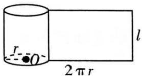

## (1) 圆柱的表面积

圆柱的侧面积: 圆柱的侧面展开图是一个矩形, 如下图, 圆柱的底面半径为 r, 母线长 l, 那么这个矩形的长等于圆柱底面周长 $C=2\pi r$ , 宽等于圆柱侧面的母线长 l （也是高）, 由此可得 $S_{圆柱侧}=Cl=2\pi rl$ .

圆柱的表面积: $S_{\text{圆柱表}} = 2\pi r^2 + 2\pi rl = 2\pi r(r + l)$ .
