## (2) 补形法

把不规则形体补成规则形体, 把不熟悉的形体补成熟悉的形体, 便于计算其体积.

常用的补形法如下:

<table><tr><td>将正四面体补为正方形</td><td>将对棱长相等的三棱锥补成长方形</td></tr><tr><td>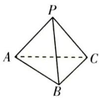 ⇒ 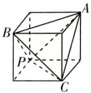</td><td>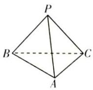 ⇒ 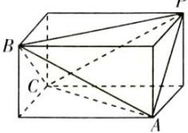</td></tr><tr><td>将三条侧棱两两垂直的三棱锥补成长方体或正方体</td><td>将三棱锥补成三棱柱</td></tr><tr><td>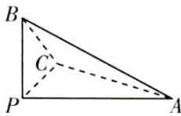 ⇒ 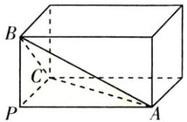</td><td>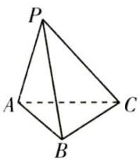 ⇒ 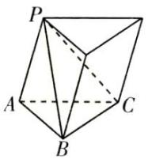</td></tr><tr><td>将三棱柱补成平行六面体</td><td>将台体补成椎体</td></tr><tr><td>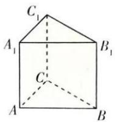 ⇒ 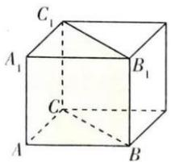</td><td>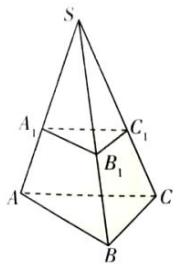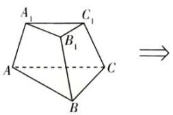</td></tr></table>
