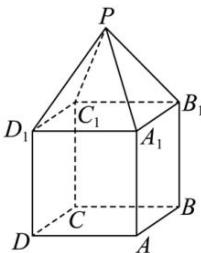

<!-- question-source:start -->
【16】(2023·宁夏银川高一)如图,某组合体是由正方体 $ABCD-A_{1}B_{1}C_{1}D_{1}$ 与正四棱锥 $P-A_{1}B_{1}C_{1}D_{1}$ 组成,已知 AB=6,且 $PA_{1}=\frac{\sqrt{3}}{2}AB$ ,求组合体的体积.

<!-- question-source:end -->

![[Q00005768A1]]
