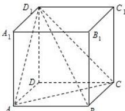

<!-- question-source:start -->
【19】如图, 正方体 $ABCD-A_{1}B_{1}C_{1}D_{1}$ 的棱长为 a，那么三棱锥 $D_{1}-ABC$ 的体积是（）

A. $\frac{1}{2} a^3$ B. $\frac{1}{3} a^3$ C. $\frac{1}{4} a^3$ D. $\frac{1}{6} a^3$
<!-- question-source:end -->

![[Q00005771A1]]
