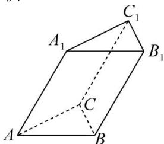

<!-- question-source:start -->
【25】(2022·全国高一课时练习) 如图, 已知斜三棱柱 $ABC - A_{1}B_{1}C_{1}$ 的底面为直角三角形, 侧棱 $A_{1}A$ 与底面所成角为 $60^{\circ}$ , 两条直角边 AC, BC 的长分别为 4cm, 3cm, 侧棱 $A_{1}A$ 的长为 10cm, 求该三棱柱的体积.

<!-- question-source:end -->

![[Q00005777A1]]
