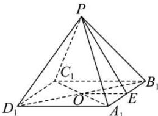

> [!faq]- 全练一本通解析
> **【答案】** 252
>
> **【解析】**
> 在正四棱锥 $P - A_{1}B_{1}C_{1}D_{1}$ 中，连接 $A_{1}C_{1}$ 、 $B_{1}D_{1}$ 交于点 $O$ ，连接 $PO$ 取 $A_{1}B_{1}$ 的中点 $E$ ，连接 $OE$ 、 $PE$ 因为 $AB = 6$ ，且 $PA_{1} = \frac{\sqrt{3}}{2} AB$ ，则 $PA_{1} = \frac{\sqrt{3}}{2}\times 6 = 3\sqrt{3}$ 所以 $A_{1}C_{1} = \sqrt{A_{1}B_{1}^{2} + C_{1}B_{1}^{2}} = 6\sqrt{2}$ ，所以 $PO = \sqrt{PA_1^2 - OA_1^2} = 3$ 所以 $S_{A_1B_1C_1D_1} = 6\times 6 = 36$ ，所以 $V_{P - A_1B_1C_1D_1} = \frac{1}{3} S_{A_1B_1C_1D_1}\cdot PO = \frac{1}{3}\times 36\times 3 = 36$ 又正方体ABCD- $A_{1}B_{1}C_{1}D_{1}$ 的体积 $V_{ABCD - A_1B_1C_1D_1} = 6^3 = 216$ 所以 $V = V_{ABCD - A_1B_1C_1D_1} + V_{P - A_1B_1C_1D_1} = 216 + 36 = 252.$
> 
