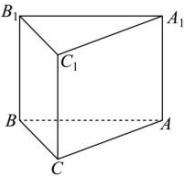

> [!faq]- 全练一本通解析
> **【答案】** D
>
> **【解析】**
> 解析:如图,正三棱柱 $ABC-A_{1}B_{1}C_{1}$ , 其侧面展开图为一个矩形,
> 当矩形长、宽分别为6和4时, 正三棱柱的高为4, 底面 $\triangle ABC$ 的边长为2, 此时 $V_{ABC-A_{1}B_{1}C_{1}} = S_{\triangle ABC} \cdot 4 = \frac{1}{2} \cdot 2^{2} \cdot \sin 60^{\circ} \cdot 4 = 4\sqrt{3}$ ;
> 当矩形长、宽分别为4和6时，正三棱柱的高为6，底面 $\triangle ABC$ 的边长为 $\frac{4}{3}$ ，此时 $V_{ABC-A_{1}B_{1}C_{1}} = S_{\triangle ABC} \cdot 6 = \frac{1}{2} \cdot (\frac{4}{3})^{2} \cdot \sin 60^{\circ} \cdot 6 = \frac{8\sqrt{3}}{3}$ .
> 所以正三棱柱的体积为 $\frac{8\sqrt{3}}{3}$ 或 $4\sqrt{3}$ . 故选:D
> 
