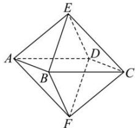

<!-- question-source:start -->
【7】（2023·全国高三专题练习）如图, 八面体的每一个面都是正三角形, 并且 4 个顶点 A, B, C, D 在同一个平面内. 如果四边形 ABCD 是边长为 30 cm 的正方形, 那么这个八面体的表面积是 \_\_\_\_ cm $^{2}$ .

<!-- question-source:end -->

![[Q00005759A1]]
