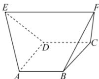

<!-- question-source:start -->
【8】（2022·江西南昌高二月考）如图，在多面体 $ABCDEF$ 中，已知 $ABCD$ 是边长为1的正方形，且 $\triangle ADE, \triangle BCF$ 均为正三角形， $EF // AB, EF = 2$ ，则该多面体的表面积为（）

A. $1 + 2\sqrt{3}$ B. $2\sqrt{3}$ C. $1 + \frac{2\sqrt{3}}{3}$ D. $1 + \sqrt{3}$
<!-- question-source:end -->

![[Q00005760A1]]
