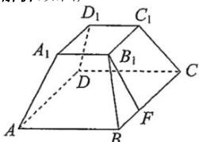

> [!faq]- 全练一本通解析
> **【答案】** $80 + 48\sqrt{15}$
>
> **【解析】**
> 如图,
> 
> 在四棱台 $ABCD-A_{1}B_{1}C_{1}D_{1}$ 中，
> 过 $B_{1}$ 作 $B_{1}F \perp BC$ ，垂足为 $F$
> 在 $Rt_{\triangle}B_{1}FB$ 中， $BF = \frac{1}{2} \times (8 - 4) = 2$ ， $B_{1}B = 8$
> 故 $B_{1}F = \sqrt{8^{2} - 2^{2}} = 2\sqrt{15}$
> 所以 $S_{梯形BB_{1}C_{1}C}=\frac{1}{2}\times(8+4)\times2\sqrt{15}=12\sqrt{15}$
> 故四棱台的侧面积 $S_{\text{侧}} = 4 \times 12\sqrt{15} = 48\sqrt{15}$
> 所以四棱台的表面积 $S_{\text{表}} = 48\sqrt{15} + 4 \times 4 + 8 \times 8 = 80 + 48\sqrt{15}$
