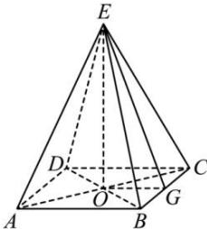

> [!faq]- 全练一本通解析
> **【答案】** 144
>
> **【解析】**
> 如图所示,正四棱锥的底面边长为8,侧棱长为 $\sqrt{41}$ ,所以 $\left|AO\right|=\frac{1}{2}\left|AC\right|=4\sqrt{2}$ ，高 $\left|EO\right|=\sqrt{\left|EA\right|^{2}-\left|AO\right|^{2}}=\sqrt{41-32}=3$ 过 O 作 OG // AB 交 BC 于 G，连接 EG，
> 因为 E - ABCD 是正四棱锥，易知 $EG \perp BC$ ，
> 且 $|EG| = \sqrt{|EO|^2 + |OG|^2} = \sqrt{9 + 16} = 5$
> 所以正四棱锥的侧面积为 $S=4\times\frac{1}{2}\times8\times5=80$ ，又底面积为 64，故正四棱锥的表面积为 144.
> 
> 故答案为:144.
