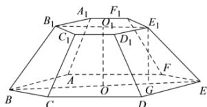
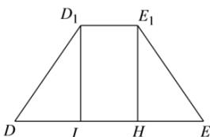

> [!faq]- 全练一本通解析
> **【答案】** C
>
> **【解析】**
> 解析:如图正六棱台中,设上底面的中心为 $O_{1}$ , 下底面的中心为 O, 过点 $E_{1}$ 作 $E_{1}G \perp BE$ ,
> 则 $O_{1}E_{1}=1,\quad OE=3,\quad E_{1}G=1$ ，所以 GE=2， $EE_{1}=\sqrt{E_{1}G^{2}+GE^{2}}=\sqrt{5}$
> 
> 在侧面 $DEE_{1}D_{1}$ 中，DE = 3， $E_{1}D_{1} = 1$ ， $EE_{1} = DD_{1} = \sqrt{5}$ ，过点 $E_{1}$ 作 $E_{1}H \perp DE$ ，则 HE = 1，
> 所以 $E_{1}H=\sqrt{EE_{1}^{2}-HE^{2}}=2$ 所以 $S_{DEE,D_{1}}=\frac{1}{2}(1+3)\times2=4$ ，所以 $S_{侧面积}=6S_{DEE,D_{1}}=24$ ；
> 
>
> 故选 **C**
