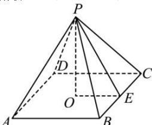

> [!faq]- 全练一本通解析
> **【答案】** 24
>
> **【解析】**
> 如图，设 $PO = 3$ ，PE是斜高，
> 
> $\because$ 侧面积是底面积的2倍， $\therefore 4\times \frac{1}{2}\times BC\times PE = 2BC^2,\therefore BC = PE.$ 在 Rt△POE 中， $PO = 3$ ， $OE = \frac{1}{2} BC = \frac{1}{2} PE$ ： $\therefore 9 + \left(\frac{PE}{2}\right)^2 = PE^2,\therefore PE = 2\sqrt{3} .$ $\therefore S_{\text{底}} = BC^{2} = PE^{2} = (2\sqrt{3})^{2} = 12$ ： $S_{\text{侧}} = 2S_{\text{底}} = 2\times 12 = 24$ 所以侧面积为24.
