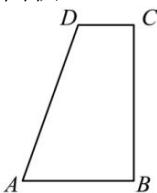

<!-- question-source:start -->
【30】(2023·全国高一课时练习)如图,在直角梯形ABCD中, $AB \parallel CD$ , $AB \perp BC$ , AB = 2CD = 2, AD = 3, 以BC边所在的直线为轴,其余三边旋转一周所形成的面围成一个几何体,求该几何体的表面积.

<!-- question-source:end -->

![[Q00005782A1]]
