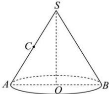

<!-- question-source:start -->
【35】（2024·安徽高三开学考试）如图，AB为圆锥SO底面圆的一条直径，点C为线段SA的中点，现沿SA将圆锥SO的侧面展开，所得的平面图形中 $\triangle ABC$ 为直角三角形，若SA=4，则圆锥SO的表面积为（）

A. $\frac{32\pi}{9}$ B. $\frac{64\pi}{9}$ C. $8\pi$ D. $12\pi$
<!-- question-source:end -->

![[Q00005787A1]]
