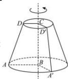

> [!faq]- 全练一本通解析
> **【答案】** $14\pi$
>
> **【解析】**
> 
> 如图所示, 满足题意的直角梯形 ABCD, 以 BC 边所在的直线为轴, 其余三边旋转一周,
> 形成一个上底面半径为 $r_{1}=CD=1$ ，下底面半径 $r_{2}=AB=2$ ，母线长 l=3 的圆台，其表面积为 $S=\pi\left(r_{1}^{2}+r_{2}^{2}+r_{1}l+r_{2}l\right)=\pi\left(1^{2}+2^{2}+1\times3+2\times3\right)=14\pi$ .
