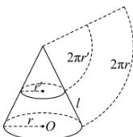

> [!faq]- 全练一本通解析
> **【答案】** $48\pi$
>
> **【解析】**
> 因为圆台的上底面圆半径2,下底面圆半径4,它的侧面展开图扇环的圆心角为 $90^{\circ}$ ,
> 设圆台的母线长为l,扇环所在的小圆的半径为x,如图,由题意可得: $\left\{\begin{aligned}\frac{1}{4}\times2\pi(l+x)=2\pi\times4\\ \frac{1}{4}\times2\pi\cdot x=2\pi\times2\end{aligned}\right.$ , 解得 $\left\{\begin{aligned}x=8\\ l=8\end{aligned}\right.$ 所以圆台的侧面积 $\pi(2+4)\times8=48\pi$ , 故答案为: $48\pi$
> 
