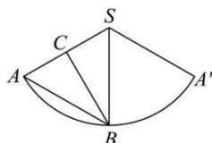

> [!faq]- 全练一本通解析
> **【答案】** B
>
> **【解析】**
> 解析:如图所示,作出展开图,可得 $\angle CAB, \angle CBA$ 为锐角,故 $BC \perp SA$ ,
> 由 SC = CA , 可得 BS = BA , 即 $\triangle ASB$ 为等边三角形, 所以 $\angle ASA' = \frac{2\pi}{3}$ ,
> 则圆锥的侧面积为 $\frac{1}{2} \times \frac{2\pi}{3} \times 16 = \frac{16\pi}{3}$ ，底面积 $\pi \times \left( \frac{4 \times \frac{2\pi}{3}}{2\pi} \right)^{2} = \frac{16\pi}{9}$ 所以圆锥 SO 的表面积为 $\frac{16\pi}{3} + \frac{16\pi}{9} = \frac{64\pi}{9}$ . 故选:B.
> 
