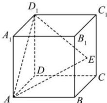

<!-- question-source:start -->
【63】(2022·江西高三联考)如图,在棱长为2的正方体 $ABCD - A_{1}B_{1}C_{1}D_{1}$ 中,E是侧面 $BB_{1}C_{1}C$ 内的一个动点,则三棱锥 $D - AED_{1}$ 的体积为\_\_\_\_.

<!-- question-source:end -->

![[Q00005815A1]]
