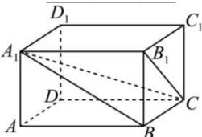

<!-- question-source:start -->
【64】(2023·四川高二)在长方体 $ABCD - A_{1}B_{1}C_{1}D_{1}$ 中， $AB = 3, AD = 2, AA_{1} = 1$ ，三棱锥 $B_{1} - A_{1}BC$ 的体积为 \_\_\_\_.

<!-- question-source:end -->

![[Q00005816A1]]
