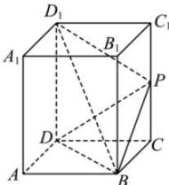

<!-- question-source:start -->
【67】如图, 在正四棱柱 $ABCD-A_{1}B_{1}C_{1}D_{1}$ 中, P 是侧棱 $CC_{1}$ 上一点, 且 $C_{1}P=2PC$ . 设三棱锥 $P-D_{1}DB$ 的体积为 $V_{1}$ , 正四棱柱 $ABCD-A_{1}B_{1}C_{1}D_{1}$ 的体积为 V, 则 $\frac{V_{1}}{V}$ 的值为（）

A. $\frac{1}{2}$ B. $\frac{1}{3}$ C. $\frac{1}{6}$ D. $\frac{1}{8}$
<!-- question-source:end -->

![[Q00005819A1]]
