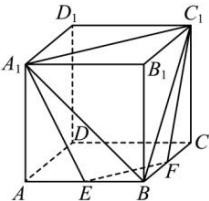

<!-- question-source:start -->
【69】(2023·贵州贵阳高二)如图,在棱长为2的正方体 $ABCD-A_{1}B_{1}C_{1}D_{1}$ 中,E,F分别为棱AB,BC的中点,则四棱锥 $B-A_{1}EFC_{1}$ 的体积为()

A. $\frac{2}{3}$ B. 1 C. $\frac{4}{3}$ D. $\frac{7}{3}$
<!-- question-source:end -->

![[Q00005821A1]]
