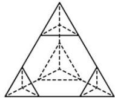
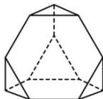

<!-- question-source:start -->
【70】（2023·湖北高三联考）截角四面体是一种半正八面体，可由四面体经过适当的截角而得到。如图，将棱长为6的正四面体沿棱的三等分点作平行于底面的截面截角得到所有棱长均为2的截角四面体，则该截角四面体的体积为（）

A. $6\sqrt{2}$ B. $\frac{20\sqrt{2}}{3}$ C. $\frac{46\sqrt{2}}{3}$ D. $16\sqrt{2}$
<!-- question-source:end -->

![[Q00005822A1]]
