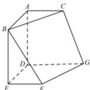

<!-- question-source:start -->
【73】如图, 多面体 ABCDEFG 是正方体被一平面所截后的空间图形, 平面 ABC 和平面 DEFG 是原正方体的上、下底面, 且满足 AB = AD = DG = 2, AC = EF = 1, 则该多面体的体积为 \_\_\_\_.

第三节 几何体的表面积与体积
<!-- question-source:end -->

![[Q00005825A1]]
