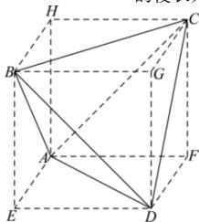

> [!faq]- 全练一本通解析
> **【答案】** D
>
> **【解析】**
> 解析:设正四面体ABCD的棱长为a，则该正四面体的表面积为 $4\times\frac{\sqrt{3}}{4}a^{2}=2\sqrt{3}$ ，可得 $a=\sqrt{2}$ .
> 将正四面体ABCD补成正方体AEDF-HBGC，则正方体
> $$
> A E D F - H B G C
> $$
> 
> 所以， $V_{A-BCD}=V_{AEDF-HBGC}-4V_{B-ADE}=1^{3}-4\times\frac{1}{3}\times\frac{1}{2}\times1^{3}=\frac{1}{3}$ .
>
> 故选 **D**.
