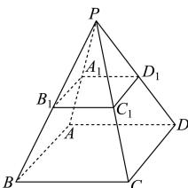

> [!faq]- 全练一本通解析
> **【答案】** $\frac{7\sqrt{3}}{6}$
>
> **【解析】**
> 如图,
> 
> 因为棱台的上、下底面的边长之比为1:2，正四棱锥P-ABCD的底面边长是2，高为 $\sqrt{3}$ ，
> 所以正四棱锥 $P-A_{1}B_{1}C_{1}D_{1}$ 的底面边长为1，高为 $\frac{\sqrt{3}}{2}$ ，
> 所以该棱台的体积为 $V_{P-ABCD}-V_{P-A_{1}B_{1}C_{1}D_{1}}=\frac{1}{3}\times2^{2}\times\sqrt{3}-\frac{1}{3}\times1^{2}\times\frac{\sqrt{3}}{2}=\frac{7\sqrt{3}}{6}$ .
> 故答案为： $\frac{7\sqrt{3}}{6}$ .
