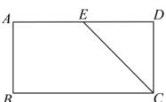
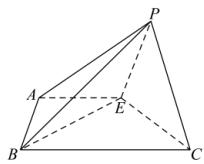

<!-- question-source:start -->
【81】(2023·全国高一专题)如图甲,在矩形ABCD中, $BC=2AB=2$ ,E是AD的中点,将△CDE沿直线CE翻折后得到四棱锥P-ABCE,如图乙,则 $V_{P-ACE}$ 与 $V_{B-PCE}$ 的比值为\_\_\_\_.

甲

乙
<!-- question-source:end -->

![[Q00005833A1]]
