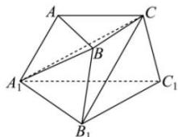

<!-- question-source:start -->
【84】如图, 三棱台 $ABC-A_{1}B_{1}C_{1}$ 中, $AB:A_{1}B_{1}=1:2$ , 三棱台 $ABC-A_{1}B_{1}C_{1}$ 的体积为 $V_{1}$ , 三棱锥 $B-A_{1}B_{1}C_{1}$ 的体积记为 $V_{2}$ , 则 $\frac{V_{1}}{V_{2}}=$ \_\_\_\_.

<!-- question-source:end -->

![[Q00005836A1]]
