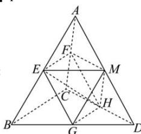

> [!faq]- 全练一本通解析
> **【答案】** 1
>
> **【解析】**
> 
> 如图所示取 $AD, BC$ 中点 $M$ ，连接 $EM, FM, MG, MH, EH$ ，
> 显然平面 $EFHG$ 截正四面体 $A-BCD$ 形成的其中一部分可由四个四面体： $AEFM$ ， $MEFH, MEGH, MDGH$ 组成，
> 易知正四面体 $A-EFM$ 与正四面体 $A-BCD$ 相似，故 $V_{A-EFM} = \frac{1}{8} V_{A-BCD}$ ，
> 由题意及中位线性质可知 $S_{\triangle FMH} = S_{\triangle FMA} \Rightarrow V_{A-EFM} = V_{E-AFM} = V_{E-FMH} = V_{M-EFH} = V_{M-EGH}$ ，
> 且 $V_{A-EFM} = V_{M-DGH}$ ，
> 所以四面体： $AEFM$ ， $MEFH, MEGH, MDGH$ 的体积均相等，故 $4V_{A-EFM} = \frac{1}{2} V_{A-BCD}$ ，所以两部分的体积之比为 1.
