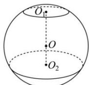

<!-- question-source:start -->
【91】（2024·贵州毕节一模）如图，圆 $O_{1}$ 和圆 $O_{2}$ 是球O的两个截面圆，且两个截面互相平行，球心O在两个截面之间，记圆 $O_{1}$ ，圆 $O_{2}$ 的半径分别为 $r_{1},r_{2}$ ，若 $r_{2}=3r_{1}=3,O_{1}O_{2}=4$ ，则球O的表面积为（）

A. $40\pi$ B. $42\pi$ C. $44\pi$ D. $48\pi$
<!-- question-source:end -->

![[Q00005843A1]]
