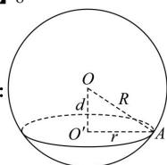

> [!faq]- 全练一本通解析
> **【答案】** 详见解析
>
> **【解析】**
> 8
> 
> 如图, 设截面圆的半径为 r, 球心与截面圆圆心之间的距离为 d, 球半径为 R.
> 由图易得 $OO'$ 与圆面 $O'$ 垂直，
> 在 Rt△OO'A 中，由 $\pi r^{2}=36\pi$ 可得 $r=6\ cm$ ，又 $R=10\ cm$ ，
> 所以 $d=\sqrt{R^{2}-r^{2}}=8\ (cm)$ ，即球心与截面圆圆心的距离为 $8\ cm$ .
