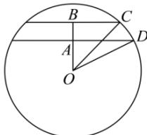
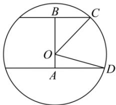

> [!faq]- 全练一本通解析
> **【答案】** D
>
> **【解析】**
> 解析:设球心为O,半径为R,
> 若两平面在球心同一侧, 画出其截面图, 如图:
> 
> 设 $OA = d$
> 由题可得 $AD = 4$ ， $BC = \sqrt{10}$ ， $AB = \sqrt{2}$ ， $OD = OC = R$ 则 $\left\{ \begin{array}{l}R^2 = 4^2 +d^2\\ R^2 = (\sqrt{10})^2 +(d + \sqrt{2})^2 \end{array} \right.$ 解得 $\left\{ \begin{array}{l}d = \sqrt{2}\\ R = 3\sqrt{2} \end{array} \right.$ 故球的直径为 $2R = 6\sqrt{2}$ 若两平面在球心两侧，画出其截面图，如图：
> 
> 设 $OA = d$ ，
> 由题可得 $AD = 4$ ， $BC = \sqrt{10}$ ， $AB = \sqrt{2}$ ， $OD = OC = R$ ，
> 则 $\left\{ \begin{array}{l}R^2 = 4^2 +d^2\\ R^2 = (\sqrt{10})^2 +(\sqrt{2} -d)^2 \end{array} \right.$ ，解得 $d = -\sqrt{2}$ （不合题意舍去）.
>
> 故选 **D**.
