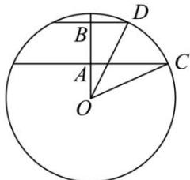
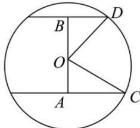

> [!faq]- 全练一本通解析
> **【答案】** $\frac{62500}{3}\pi \mathrm{cm}^3$
>
> **【解析】**
> - **①**：当两个平行截面在球心同一侧,作出球的截面图,如图:
> 
> ∵截面圆的面积分别为 $49\pi cm^{2}$ 和 $400\pi cm^{2}$ ，
> ∴对应的半径 BD = 7cm, AC = 20cm,
> 且 AB = 9cm，
> 设球半径为 r，
> 则 $OA = \sqrt{r^{2} - 400}$ , $OB = \sqrt{r^{2} - 49}$ ,
> 又 $\sqrt{r^{2}-49}=9+\sqrt{r^{2}-400}$ 解得 r=25cm，
> ∴球的体积为 $\frac{4\pi}{3}\times25^{3}cm^{3}=\frac{62500\pi}{3}cm^{3}$ ;
> - **②**：当两个平行截面在球心两侧时,作出球的截面图,如图:
> 
> ∵截面圆的面积分别为 $49\pi cm^{2}$ 和 $400\pi cm^{2}$ ，
> ∴对应的半径 BD = 7cm, AC = 20cm,
> 且 AB = 9cm,
> 设球半径为 r，
> 则 $OA = \sqrt{r^{2} - 400}$ , $OB = \sqrt{r^{2} - 49}$ ，无解.
> 综上, 球的体积为 $\frac{62500\pi}{3}cm^{3}$
