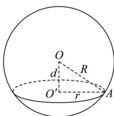

## 题型 2: 球的截面问题

## 球的截面的性质：

1. 球的轴截面（过球心的截面）是将球的问题（立体几何问题）转化为圆的问题（平面问题）的关键，因此在解决球的有关问题时，我们必须抓住球的轴截面，并充分利用它来分析解决问题。

2.用一个平面去截一个球, 截面是圆面, 如图, 球的截面有以下性质:
①球心和截面圆圆心的连线垂直于截面;
②球心到截面的距离 d 与球的半径 R 及截面的半径 r 满足关系 $d = \sqrt{R^{2} - r^{2}}$ .

![[高中/课堂同步/题库/高中数学全练一本通/立体几何初步/第三节 几何体的表面积与体积/题目/题型 2_ 球的截面问题/questions/Q00005839.md]]
![[高中/课堂同步/题库/高中数学全练一本通/立体几何初步/第三节 几何体的表面积与体积/题目/题型 2_ 球的截面问题/questions/Q00005840.md]]
![[高中/课堂同步/题库/高中数学全练一本通/立体几何初步/第三节 几何体的表面积与体积/题目/题型 2_ 球的截面问题/questions/Q00005841.md]]
![[高中/课堂同步/题库/高中数学全练一本通/立体几何初步/第三节 几何体的表面积与体积/题目/题型 2_ 球的截面问题/questions/Q00005842.md]]
![[高中/课堂同步/题库/高中数学全练一本通/立体几何初步/第三节 几何体的表面积与体积/题目/题型 2_ 球的截面问题/questions/Q00005843.md]]
![[高中/课堂同步/题库/高中数学全练一本通/立体几何初步/第三节 几何体的表面积与体积/题目/题型 2_ 球的截面问题/questions/Q00005844.md]]
![[高中/课堂同步/题库/高中数学全练一本通/立体几何初步/第三节 几何体的表面积与体积/题目/题型 2_ 球的截面问题/questions/Q00005845.md]]
![[高中/课堂同步/题库/高中数学全练一本通/立体几何初步/第三节 几何体的表面积与体积/题目/题型 2_ 球的截面问题/questions/Q00005846.md]]
