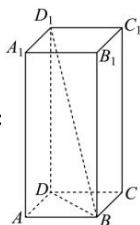

> [!faq]- 全练一本通解析
> **【答案】** D
>
> **【解析】**
> 
> 解析：
> 如图, 正四棱柱 $ABCD - A_{1}B_{1}C_{1}D_{1}$ 中, 设其底面边长为 $a$ , 侧棱长为 $b$ , 体积为 $V$ , 外切球的半径为 $R$ .
> 依题可得: $\frac{4ab}{2a^2} = 4$ , 解得: $b = 2a$ ①.
> 又 $V = a^2 b = 4\sqrt{2}$ ②, 由①②解得: $a = \sqrt{2}, b = 2\sqrt{2}$ .
> 因正四棱柱的体对角线 $BD_{1}$ 即其外切球的直径, 故 $R = \frac{\sqrt{a^2 + a^2 + b^2}}{2} = \sqrt{3}$ . 于是, 这个球的体积为: $\frac{4\pi R^3}{3} = 4\sqrt{3}\pi$ .
>
> 故选 **D**.
