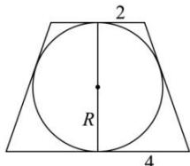

> [!faq]- 全练一本通解析
> **【答案】** $32\pi$
>
> **【解析】**
> 依题意，削成的球体积最大，当且仅当该球为圆台的内切球，设球半径为 $R$ ，过圆台轴的截面截球所得大圆是圆台轴截面等腰梯形的内切圆，则梯形的高为 $2R$ ，由圆的外切四边形性质可知，等腰梯形的腰长为 $\frac{2 + 8}{2} = 6$ ，因此 $(4 - 2)^{2} + (2R)^{2} = 6^{2}$ ，解得 $R^2 = 8$ ，所以球的表面积 $S = 4\pi R^2 = 32\pi$ .故答案为： $32\pi$
> 
