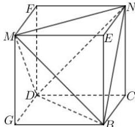

> [!faq]- 全练一本通解析
> **【答案】** A
>
> **【解析】**
> 解析:如图,四面体 BDMN 是正四面体,棱长 BD=2 ,将其补形成正方体 GBCD-MENF ,
> 
> 则正方体 GBCD-MENF 的棱长 $GB=\frac{\sqrt{2}}{2}BD=\sqrt{2}$ ，此正方体的体对角线长为 $\sqrt{6}$ ，
> 正四面体 BDMN 与正方体 GBCD-MENF 有相同的外接球，则正四面体 BDMN 的外接球半径 $R=\frac{\sqrt{6}}{2}$ ，
> 所以正四面体 BDMN 的外接球体积为 $V = \frac{4}{3}\pi R^{3} = \frac{4}{3}\pi \cdot \left(\frac{\sqrt{6}}{2}\right)^{3} = \sqrt{6}\pi$ .
>
> 故选 **A**
