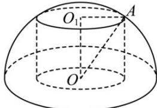

> [!faq]- 全练一本通解析
> **【答案】** $16\pi$
>
> **【解析】**
> 依题意,设球的半径为 OA = R , 圆柱的高为 $OO_{1} = h$ , 底面半径为 $O_{1}A = r$ ,
> 如图所示:
> 
> $$
> r ^ {2} + h ^ {2} = R ^ {2} = 4
> $$
> 所以 $4 = r^2 + h^2 \geq 2rh \Leftrightarrow rh \leq 2$ 当且仅当 $r = h$ 时，取到等号，因此剩下的几何体的表面积为： $S = 3\pi R^2 + 2\pi rh \leq 12\pi + 4\pi = 16\pi$ 故答案为： $16\pi$ 。
