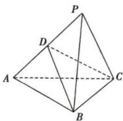
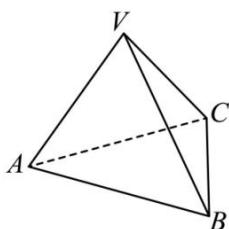

<!-- question-source:start -->
【1】如图 1, 在四面体 P-ABC 中, $\triangle ABC$ 与 $\triangle PBC$ 是边长为 2 的正三角形, PA=3, D 为 PA 的中点, 则二面角 D-BC-A 的大小为 \_\_\_\_.

图1

图2
<!-- question-source:end -->

![[Q00006108A1]]
