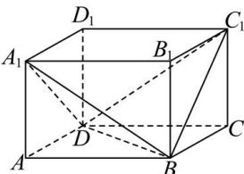

<!-- question-source:start -->
【4】（2024·上海浦东新高二上期中）如图, 正方体 $ABCD - A_{1}B_{1}C_{1}D_{1}$ 中, $AB = AD = AA_{1} = 4$ , 则二面角 $A_{1} - BD - C_{1}$ 的余弦值为 \_\_\_\_.

<!-- question-source:end -->

![[Q00006111A1]]
