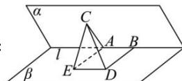

> [!faq]- 全练一本通解析
> **【答案】** 详见解析
>
> **【解析】**
> 解析：
> 
> 如图, 在二面角 $\alpha - l - \beta$ 中, 过 $A$ 在平面 $\beta$ 内作 $AE \perp l$ , 并取 $AE = BD = 4$ , 连接 $DE, CE$ ,
> 所以 $AE // BD$ , 所以四边形 $AEDB$ 为矩形, $\angle CAE$ 为二面角 $\alpha - l - \beta$ 的平面角. $l \perp AC, l \perp AE, AC \cap AE = A, AC \subset$ 面 $ACE, AE \subset$ 面 $ACE$ ,
> 所以 $l \perp$ 面 $ACE, CE \subset$ 面 $ACE$ , 故 $l \perp CE$ , 又四边形 $AEDB$ 为矩形, 所以 $AB // ED$ , 所以 $CE \perp ED$ .
> 在直角三角形 $CED$ 中, $DE = AB = 2, CD = \sqrt{17}$ , 所以 $CE = \sqrt{CD^2 - DE^2} = \sqrt{13}$ .
> 在三角形 $CEA$ 中, $AC = 3, AE = 4, CE = \sqrt{13}$ , 由余弦定理
> 得: $\cos \angle CAE = \frac{AC^2 + AE^2 - CE^2}{2AC \cdot AE} = \frac{3^2 + 4^2 - 13}{2 \times 3 \times 4} = \frac{1}{2}$ ,
> 又 $\angle CAE \in (0, \pi)$ , 所以 $\angle CAE = \frac{\pi}{3}$ 即平面 $\alpha$ 与 $\beta$ 的夹角是 $\frac{\pi}{3}$ ,
> 故答案为: $\frac{\pi}{3}$ .
