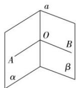

## 方法 1: 定义法求二面角

如图所示, 以二面角的棱 a 上的任意一点 O 为端点, 在两个面内分别作垂直于 a 的两条射线 OA, OB, 则 $\angle AOB$ 为此二面角的平面角.

![[高中/课堂同步/题库/高中数学全练一本通/立体几何初步/第九节 专题-二面角的四种求法/▶ ▷ 重点题型专练/方法 1_ 定义法求二面角/questions/Q00006108.md]]
![[高中/课堂同步/题库/高中数学全练一本通/立体几何初步/第九节 专题-二面角的四种求法/▶ ▷ 重点题型专练/方法 1_ 定义法求二面角/questions/Q00006109.md]]
![[高中/课堂同步/题库/高中数学全练一本通/立体几何初步/第九节 专题-二面角的四种求法/▶ ▷ 重点题型专练/方法 1_ 定义法求二面角/questions/Q00006110.md]]
![[高中/课堂同步/题库/高中数学全练一本通/立体几何初步/第九节 专题-二面角的四种求法/▶ ▷ 重点题型专练/方法 1_ 定义法求二面角/questions/Q00006111.md]]
