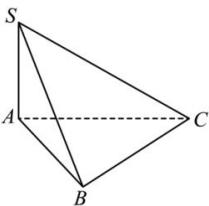

<!-- question-source:start -->
【11】（2023·全国高一专题）如图, 三棱锥 S-ABC 中, 已知 $\angle SAB = \angle SAC = \angle ABC = 90^{\circ}$ , SA = AB, SB = BC. 求二面角 A-SC-B 的平面角的正弦值.

<!-- question-source:end -->

![[Q00006118A1]]
