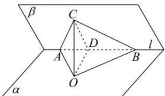

> [!faq]- 全练一本通解析
> **【答案】** 详见解析
>
> **【解析】**
> 解析: 过点 C 作 $CO \perp \alpha$ ，交 $\alpha$ 于 O，连结 AO，BO，作 $CD \perp l$ ，交 l 于点 D，连结 OD，
> 则 $\angle CDO$ 是二面角 $\alpha - l - \beta$ 的平面角， $\because Rt\Delta ABC$ 在平面 $\beta$ 内， $\angle ACB = 90^{\circ}$ ，斜边 AB 在二面角 $\alpha - l - \beta$ 的棱 l 上，
> AC 与平面 $\alpha$ 所成角为 $45^{\circ}$ ，BC 与平面 $\alpha$ 所成角为 $30^{\circ}$ ， $\therefore \angle CAO = 45^{\circ}$ ， $\angle CBO = 30^{\circ}$ ，
> 设 CO = 1，则 AO = 1， $AC = \sqrt{2}$ ，BC = 2， $BO = \sqrt{3}$ ， $AB = \sqrt{6}$ ， $CD = \frac{AC \times BC}{AB} = \frac{\sqrt{2} \times 2}{\sqrt{6}} = \frac{2}{\sqrt{3}}$ ， $AD = \sqrt{2 - \frac{4}{3}} = \sqrt{\frac{2}{3}}$ ， $OD = \sqrt{1 - \frac{2}{3}} = \sqrt{\frac{1}{3}}$ ， $\therefore \cos \angle CDO = \frac{CD^{2} + OD^{2} - CO^{2}}{2 \times CD \times OD} = \frac{\frac{4}{3} + \frac{1}{3} - 1}{2 \times \sqrt{\frac{4}{3}} \times \sqrt{\frac{1}{3}}} = \frac{1}{2}$ ， $\therefore \angle CDO = 60^{\circ}$ ， $\therefore$ 二面角 $\alpha - l - \beta$ 的平面角大小为 $60^{\circ}$ 。故答案为： $\frac{\pi}{2}$
> ∴二面角 $\alpha-l-\beta$ 的平面角大小为 $60^{\circ}$ . 故答案为: $\frac{\pi}{3}$ .
> 
