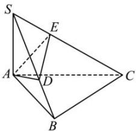

> [!faq]- 全练一本通解析
> **【答案】** $\frac{\sqrt{6}}{3}$ .
>
> **【解析】**
> 取 SB 的中点 D，连接 AD，
> 因为 SA = AB，
> 所以 $AD \perp SB$ ，垂足为点 D，
> 因为 $SA \perp AB, SA \perp AC, AB \cap AC = A, AB, AC \subset$ 平面 ABC，
> 所以 $SA \perp$ 平面 ABC，又 $BC \subset$ 平面 ABC，
> 所以 $SA \perp BC$ ，又 $BC \perp AB, SA \cap AB = A, SA, AB \subset$ 平面 SAB，
> 所以 $BC \perp$ 平面 SAB， $AD \subset$ 平面 SAB，所以 $BC \perp AD$ 因为 $AD \perp SB, SB \cap BC = B, SB, BC \subset$ 平面 SBC，
> 所以 $AD \perp$ 平面 SBC， $SC \subset$ 平面 SBC，
> 所以 $AD \perp SC$ 作 AE⊥SC，垂足为点 E，连接 DE，
> 因为 $AD \cap AE = A, AD, AE \subset$ 平面 ADE，
> 所以 SC⊥平面 ADE， $DE \subset$ 平面 ADE，
> 则 DE⊥SC，
> 则 $\angle AED$ 为二面角 A-SC-B 的平面角.
> 设 SA = AB = 2a
> 则 $SB = BC = 2\sqrt{2}a,\quad AD = \sqrt{2}a,\quad AC = 2\sqrt{3}a,\quad SC = 4a.$ 由题意得 $AE=\frac{SA\cdot AC}{SC}=\sqrt{3}a$ Rt△ADE 中， $\sin\angle AED=\frac{AD}{AE}=\frac{\sqrt{2}}{\sqrt{3}}=\frac{\sqrt{6}}{3}$ 所以二面角 A-SC-B 的平面角的正弦值为 $\frac{\sqrt{6}}{3}$ .
> 
